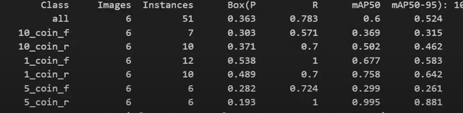
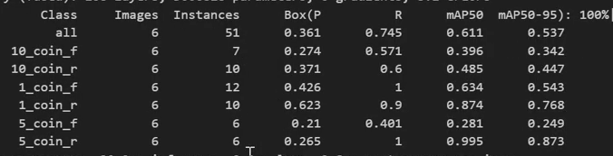
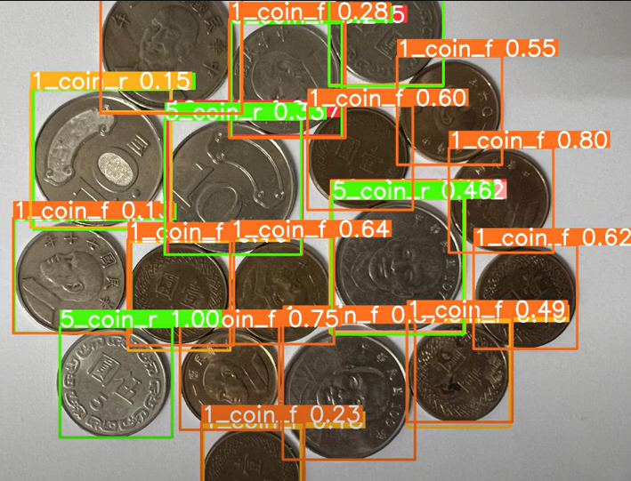

# YOLOv8_image_analysis_test
 Use YoloV8 to train and recognize the Taiwan Dollar

# 第一步 環境安裝

參考Youtube 網站 : https://www.youtube.com/watch?v=lMe6ruWT_tE 
但是要注意本機的CUDA 的版本, 不一定會跟作者一樣.

# 第2步 準備訓練資料

參考Youtube 網站 : https://youtu.be/RmnKnxCiMl8 
跟著作者安裝labelimg 很順利的完成, 并且發現這套軟體的標識很方便.

v0 版本是把 1元 5元 10元 同時標注 , 但是人頭面的效果不是很好.

# 第3步 模型訓練

參考Youtube 網站 :https://www.youtube.com/watch?v=srT7UsW2KMQ&t=76s
跟著作者建立yaml, 放置模型, 寫訓練檔, 二次訓練, 完成整個流程. 

第一次的訓練結果:

第二次的訓練結果:

# 第4步 在測試照片進行辨識分析

辨識的結果如下圖:
